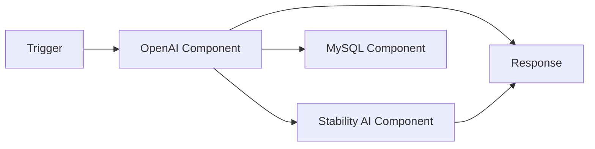
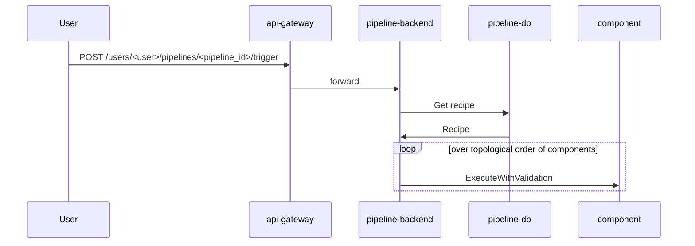

# Contributing Guidelines

We appreciate your contribution to this amazing project! Any form of engagement
is welcome, including but not limiting to
- feature request
- documentation wording
- bug report
- roadmap suggestion
- ...and so on!

Please refer to the [community contributing
section](https://github.com/instill-ai/community#contributing) for more details.

## Concepts

Before delving into the details to come up with your first PR, please
familiarize yourself with the project structure of [Instill
Core](https://github.com/instill-ai/community#instill-core).

### Pipeline

In VDP, a **pipeline** is a DAG (Directed Acyclic Graph) consisting of multiple
**components**.




### Component

There are different types of component: **AI**, **Data**, **Application**, **Operator** and **Iterator**.

#### AI

**AI** components play a crucial role in transforming unstructured data into formats that are easy to interpret and analyze, thereby facilitating the extraction of valuable insights. These components integrate with AI models from various providers, whether it's the primary Instill Model or those from third-party AI vendors. They are defined and initialized in the [ai](../ai) package.

#### Data

**Data** components play a crucial role in establishing connections with remote data sources, such as IoT devices (e.g., IP cameras), cloud storage services (e.g., GCP Cloud Storage, AWS S3), data warehouses, or vector databases (e.g., Pinecone). These connectors act as the bridge between VDP and various external data sources. Their primary function is to enable seamless data exchange, enhancing Instill VDP's capability to work with diverse data sources effectively. They are defined and initialized in the [data](../data) package.

#### Application

**Application** components are used to seamlessly integrate various 3rd-party application services. They are defined and initialized in the [application](../application) package.

#### Operator

**Operator** components perform data transformations inside the pipeline. They are defined
  and initialized in the [operator](../operator) package.

#### Iterator

**Iterator** takes an array and executes an operation (defined by a set of nested components)
on each of its elements.

#### Connection
- For **AI**, **Data**, **Application** components, they are used by the pipeline to interact with an external service, you may need to introduce its **connection** details in the component connection properties.
  - In order to prevent private keys from being unintentionally leaked when
    sharing a pipeline, the connection properties only take reference to a
    **secret** (e.g. `${secrets.my-secret}`).
  - You can create secrets from the console settings or through an [API
    call](https://openapi.instill.tech/reference/pipelinepublicservice_createusersecret).

### Recipe

A **pipeline recipe** specifies how components are configured and how they are
interconnected.

Recipes are represented by a JSON object:

```json
{
  "version": "v1beta",
  "components": [
    {
      "id": "<component_id>", // must be unique within the pipeline.
      "<component_type>": { // operator_component, connector_component
        "definition_name": "<definition_name>",
        "task": "<task>",
        "input": {
          // values for the input fields
        },
        "condition": "<condition>", // conditional statement to execute or bypass the component
        "connection": {
          // connection specification values, optional
        }
      }
    },
  ],
  "trigger": {
    "trigger_by_request": {
      "request_fields": {
        // pipeline input fields
      },
      "response_fields": {
        // pipeline output fields
      }
    }
  }
}
```

You can see an example recipe in the [component development
guide](#example-recipe)


### Trigger

When a pipeline is triggered, the DAG will be computed in order to execute
components in topological order.



## Development

This section will guide you through the steps to contribute with a new
component. You'll add and test an operator that takes a string `target` as input
and returns a `"Hello, ${target}!"` string as the component output

In order to add a new component, you need to:
- Define the component configuration. This will determine the tasks that can be
  performed by the component and their input and output parameters. The
  `console` frontend will use this configuration files to render the component
  in the pipeline builder.
- Implement the component interfaces so `pippeline-backend` can execute the
  component without knowing its implementation details.
- Initialize the component, i.e., include the implementation of the component
  interfaces as a dependency in the `pipeline-backend` execution.

### Environment setup

Start by cloning this repository:

```sh
$ git clone https://github.com/instill-ai/component
```

Although all the development will be done in this repository, if you want to
[see your component in action](#use-the-component-in-vdp), you'll need to build
VDP locally. First, launch the latest version of
[Core](https://github.com/instill-ai/instill-core). Then, build and
launch [VDP](https://github.com/instill-ai/pipeline-backend) with
your local changes.

If you want to know more, you can refer to the documentation in these
repositories, which explains in detail how to set up the
development environment. In short, here's what we'll need to do for this guide:

#### Building Core

```sh
$ git clone https://github.com/instill-ai/instill-core && cd instill-core
$ make latest PROFILE=all
```

#### Buidling VDP

```sh
$ git clone https://github.com/instill-ai/pipeline-backend && cd pipeline-backend
$ make build
```

`component` is a dependency in `pipeline-backend` so, in order to take your
changes into account, you need reference them.

```sh
$ go mod edit -replace="github.com/instill-ai/component=../component"
```

Then, mount the `component` directory when running the `pipeline-backend`
container. Add the `-v $(PWD)/../component:/component` option to `make dev` in
the Makefile:

```Makefile
dev:							## Run dev container
	@docker compose ls -q | grep -q "instill-core" && true || \
		(echo "Error: Run \"make latest PROFILE=pipeline\" in vdp repository (https://github.com/instill-ai/instill-core) in your local machine first." && exit 1)
	@docker inspect --type container ${SERVICE_NAME} >/dev/null 2>&1 && echo "A container named ${SERVICE_NAME} is already running." || \
		echo "Run dev container ${SERVICE_NAME}. To stop it, run \"make stop\"."
	@docker run -d --rm \
		-v $(PWD):/${SERVICE_NAME} \
		-v $(PWD)/../component:/component \
		-p ${SERVICE_PORT}:${SERVICE_PORT} \
		--network instill-network \
		--name ${SERVICE_NAME} \
		instill/${SERVICE_NAME}:dev >/dev/null 2>&1
```

2 processes must know about the new component: `main` and `worker`. You'll need
to stop their Core version before running the local one.

```sh
$ docker rm -f pipeline-backend pipeline-backend-worker
$ make dev
$ docker exec -d pipeline-backend go run ./cmd/worker # run without -d in a separate terminal if you want to access the logs
$ docker exec pipeline-backend go run ./cmd/main
```

### Create the component package

```sh
$ cd $WORKSPACE/component
$ mkdir -p operator/hello/v0 && cd $_
```

Components are isolated in their own packages under `ai`, `data`, `application` or
`operator`. The package is versioned so, in case a breaking change needs to
be introduced (e.g. supporting a new major version in a vendor API), existing
pipelines using the previous version of the component can keep being triggered.

At the end of this guide, this will be the structure of the package:

```
operator/hello/v0
 ├──assets
 │  └──hello.svg
 ├──config
 │  ├──definition.json
 │  └──tasks.json
 ├──main.go
 ├──operator_test.go
 └──README.mdx
 ```

### Add the configuration files

Create a `config` directory and add the files `definition.json` and
`tasks.json`. Together, they define the behaviour of the component.

#### `definition.json`

```json
{
  "available_tasks": [
    "TASK_GREET"
  ],
  "custom": false,
  "documentation_url": "https://www.instill.tech/docs/latest/vdp/operators/hello",
  "icon": "assets/hello.svg",
  "id": "hello",
  "public": true,
  "spec": {},
  "title": "Hello",
  "uid": "e05d3d71-779c-45f8-904d-e90a050ca3b2",
  "version": "0.1.0",
  "source_url": "https://github.com/instill-ai/component/blob/main/operator/hello/v0",
  "description": "'Hello, world' operator used as a template for adding components",
  "release_stage": "RELEASE_STAGE_ALPHA"
}
```

This file defines the component properties:
- `id` is the ID of the component. It must be unique.
- `uid` is a UUID string that must not be already taken by another component.
  Once it is set, it must not change.
- `title` is the end-user name of the component.
- `description` is a short sentence describing the purpose of the component. It
  should be written in imperative tense.
- `spec` contains the parameters required to configure the component and that
  are independent from its tasks. E.g., the API token of a vendor. In general,
  only AI, data or application components need such parameters.
- `available_tasks` defines the tasks the component can perform.
  - When a component is created in a pipeline, one of the tasks has to be
    selected, i.e., a configured component can only execute one task.
  - Task configurations are defined in `tasks.json`.
- `documentation_url` points to the official documentation of the component.
- `icon` is the local path to the icon that will be displayed in the Console
  when creating the component. If left blank, a placeholder icon will be shown.
- `version` must be a [SemVer](https://semver.org/) string. It is encouraged to
  keep a [tidy version history](#sane-version-control).
- `source_url` points to the codebase that implements the component. This will
  be used by the documentation generation tool and also will be part of the
  [component definition list](https://openapi.instill.tech/reference/pipelinepublicservice_listcomponentdefinitions) endpoint.
- `release_stage` describes the release stage of the component. Unimplemented
  stages (`RELEASE_STAGE_COMING_SOON` or `RELEASE_STAGE_OPEN_FOR_CONTRIBUTION`)
  will hide the component from the console (i.e. they can't be used in
  pipelines) but they will appear in the component definition list endpoint.


#### `tasks.json`

```json
{
  "TASK_GREET": {
    "instillShortDescription": "Greet someone / something",
    "title": "Greet",
    "input": {
      "description": "Input",
      "instillUIOrder": 0,
      "properties": {
        "target": {
          "instillUIOrder": 0,
          "description": "The target of the greeting",
          "instillAcceptFormats": [
            "string"
          ],
          "instillUpstreamTypes": [
            "value",
            "reference",
            "template"
          ],
          "instillUIMultiline": true,
          "title": "Greeting target",
          "type": "string"
        }
      },
      "required": [
        "target"
      ],
      "title": "Input",
      "type": "object"
    },
    "output": {
      "description": "The greeting sentence",
      "instillUIOrder": 0,
      "properties": {
        "greeting": {
          "description": "A greeting sentence addressed to the target",
          "instillEditOnNodeFields": [],
          "instillUIOrder": 0,
          "required": [],
          "title": "Greeting",
          "type": "string",
          "instillFormat": "string"
        }
      },
      "required": [
        "greeting"
      ],
      "title": "Output",
      "type": "object"
    }
  }
}
```

This file defines the input and output schema of each task:

- `title` and `instillShortDescription` will be used by the frontend to provide
  information about the task.
- For each property within the `input` and `output` objects:
  - `instillUIOrder` defines the order in which the properties will be rendered
    by the frontend.
  - `required` properties will appear at the forefront of the component UI.
    Optional properties can be set in the advanced configuration.
  - `instillUpstreamTypes` define how an input property can be set: the direct
    value, a reference to another value in the pipeline (e.g.
    `${trigger.name}` or a combination of both (`my dear ${trigger.name}`).

See the [example recipe](#example-recipe) to see how these fields map to the recipe
of a pipeline when configured to use this operator.


### Implement the component interfaces

Pipeline communicates with components through the `IComponent`, `IConnector`,
`IOperator` and `IExecution` interfaces, defined in the [`base`](../base)
package. This package also defines base implementations for these interfaces, so
the `hello` component will only need to override the following methods:
- `CreateExecution(vars map[string]any, task string) (*ExecutionWrapper, error)`
  will return an object that implements the `Execute` method.
  - `ExecutionWrapper` will wrap the execution call with the input and output
    schema validation.
- `Execute(context.Context []*structpb.Struct) ([]*structpb.Struct, error)` is the most
  important function in the component. All the data manipulation will take place
  here.

Paste the following code into a `main.go` file in `operator/hello/v0`:

```go
package hello

import (
	_ "embed"
	"fmt"
	"sync"

	"go.uber.org/zap"
	"google.golang.org/protobuf/types/known/structpb"

	"github.com/instill-ai/component/base"
)

const (
	taskGreet = "TASK_GREET"
)

var (
	//go:embed config/definition.json
	definitionJSON []byte
	//go:embed config/tasks.json
	tasksJSON []byte

	once sync.Once
	op   *operator
)

type operator struct {
	base.BaseOperator
}

type execution struct {
	base.BaseOperatorExecution
}

// Init returns an implementation of IOperator that implements the greeting
// task.
func Init(bo base.BaseOperator) *operator {
	once.Do(func() {
		op = &operator{BaseOperator: bo}
		err := op.LoadOperatorDefinition(definitionJSON, tasksJSON, nil)
		if err != nil {
			panic(err)
		}
	})
	return op
}

func (o *operator) CreateExecution(sysVars map[string]any, task string) (*base.ExecutionWrapper, error) {
	e := &execution{
		BaseOperatorExecution: base.BaseOperatorExecution{Operator: o, SystemVariables: sysVars, Task: task},
	}

	if task != taskGreet {
		return nil, fmt.Errorf("unsupported task")
	}

	return &base.ExecutionWrapper{Execution: e}, nil
}

func (e *execution) Execute(context.Context, []*structpb.Struct) ([]*structpb.Struct, error) {
	return nil, nil
}
```

### Add the execution logic

The `hello` operator created in the previous section doesn't implement any
logic. This section will add the greeting logic to the `Execute` method.

Let's modify the following methods:

```go
type execution struct {
	base.BaseOperatorExecution
	execute func(*structpb.Struct) (*structpb.Struct, error)
}

func (o *operator) CreateExecution(sysVars map[string]any, task string) (*base.ExecutionWrapper, error) {
	e := &execution{
		BaseOperatorExecution: base.BaseOperatorExecution{Operator: o, SystemVariables: sysVars, Task: task},
	}

	// A simple if statement would be enough in a component with a single task.
	// If the number of task grows, here is where the execution task would be
	// selected.
	switch task {
	case taskGreet:
		e.execute = e.greet
	default:
		return nil, fmt.Errorf("unsupported task")
	}
	return &base.ExecutionWrapper{Execution: e}, nil
}

func (e *execution) Execute(_ context.Context, inputs []*structpb.Struct) ([]*structpb.Struct, error) {
	outputs := make([]*structpb.Struct, len(inputs))

	// An execution  might take several inputs. One result will be returned for
	// each one of them, containing the execution output for that set of
	// parameters.
	for i, input := range inputs {
		output, err := e.execute(input)
		if err != nil {
			return nil, err
		}

		outputs[i] = output
	}

	return outputs, nil
}

func (e *execution) greet(in *structpb.Struct) (*structpb.Struct, error) {
	out := new(structpb.Struct)

	target := in.Fields["target"].GetStringValue()
	greeting := "Hello, " + target + "!"

	out.Fields = map[string]*structpb.Value{
		"greeting": structpb.NewStringValue(greeting),
	}

	return out, nil
}
```

#### Unit tests

Before initializing testing your component in VDP, we can unit test its
behaviour. The following covers the newly added logic by replicating how the
`pipeline-backend` workers execute the component logic:

```go
package hello

import (
	"testing"

	qt "github.com/frankban/quicktest"
	"go.uber.org/zap"
	"google.golang.org/protobuf/types/known/structpb"
)

func TestOperator_Execute(t *testing.T) {
	c := qt.New(t)
	ctx := context.Background()

	bo := base.BaseOperator{Logger: zap.NewNop()}
	operator := Init(bo)

	c.Run("ok - greet", func(c *qt.C) {
		exec, err := operator.CreateExecution(nil, taskGreet)
		c.Assert(err, qt.IsNil)

		pbIn, err := structpb.NewStruct(map[string]any{"target": "bolero-wombat"})
		c.Assert(err, qt.IsNil)

		got, err := exec.Execution.Execute(ctx, []*structpb.Struct{pbIn})
		c.Check(err, qt.IsNil)
		c.Assert(got, qt.HasLen, 1)

		// Check JSON in the output string.
		greeting := got[0].Fields["greeting"].GetStringValue()
		c.Check(greeting, qt.Equals, "Hello, bolero-wombat!")
	})
}

func TestOperator_CreateExecution(t *testing.T) {
	c := qt.New(t)

	bo := base.BaseOperator{Logger: zap.NewNop()}
	operator := Init(bo)

	c.Run("nok - unsupported task", func(c *qt.C) {
		task := "FOOBAR"

		_, err := operator.CreateExecution(nil, task)
		c.Check(err, qt.ErrorMatches, "unsupported task")
	})
}
```

### Initialize the component

The last step before being able to use the component in VDP is loading the
`hello` operator. This is done in the `Init` function in
[`component.go`](../component.go):

```go
package operator

import (
	// ...
	"github.com/instill-ai/component/operator/hello/v0"
)

// ...

func Init(logger *zap.Logger) *Store {
	baseOp := base.BaseOperator{Logger: logger}

	once.Do(func() {
		store = &Store{
			operatorUIDMap: map[uuid.UUID]*operator{},
			operatorIDMap:  map[string]*operator{},
		}
		// ...
		store.ImportOperator(hello.Init(baseOp))
	})

	return store
}
```

### Use the component in VDP

Re-run your local `pipeline-backend` build:

```sh
$ make stop && make dev
$ docker exec -d pipeline-backend go run ./cmd/worker # run without -d in a separate terminal if you want to access the logs
$ docker exec pipeline-backend go run ./cmd/main
```

Head to the console at http://localhost:3000/ (default password is `password`)
and create a pipeline.

- In the **trigger** component, add a `who` text field.
- Create a **hello** operator and reference the **trigger** input field by adding
  `${trigger.who}` to the `target` field.
- In the **response** component, add a `greeting` output value that references the
  **hello** output by introducing `${hello_0.output.greeting}`.

If you introduce a `Wombat` string value in the **trigger** component and
**Run** the pipeline, you should see `Hello, Wombat!` in the response.

#### Example recipe

The created pipeline will have the following recipe:

```json
{
  "version": "v1beta",
  "components": [
    {
      "id": "hello_0",
      "operator_component": {
        "definition_name": "operator-definitions/hello",
        "definition": null,
        "task": "TASK_GREET",
        "input": {
          "target": "${trigger.who}"
        },
        "condition": ""
      }
    }
  ],
  "trigger": {
    "trigger_by_request": {
      "request_fields": {
        "who": {
          "title": "Who",
          "description": "Who should be greeted?",
          "instill_format": "string",
          "instill_ui_order": 0,
          "instill_ui_multiline": false
        }
      },
      "response_fields": {
        "greeting": {
          "title": "Greeting",
          "description": "",
          "value": "${hello_0.output.greeting}",
          "instill_ui_order": 0
        }
      }
    }
  }
}
```

### Document the component

Documentation helps user to integrate the component in their pipelines. A good
component definition will have clear names for their fields, which will also
contain useful descriptions. The information described in `definition.json` and
`tasks.json` is enough to understand how a component should be used. `compogen`
is a tool that parses the component configuration and builds a `README.mdx` file
document displaying its information in a human-readable way. To generate the
document, just add the following line on top of `operator/hello/v0/main.go`:

```go
//go:generate compogen readme --operator ./config ./README.mdx
```

Then, go to the base of the `component` repository and run:

```sh
$ make build-doc && make gen-doc
```

## Sane version control

The version of a component is useful to track its evolution and to set
expectations about its stability. When the interface of a component (defined by
its configuration files) changes,
its version should change following the Semantic Versioning guidelines.

- Patch versions are intended for bug fixes.
- Minor versions are intended for backwards-compatible changes, e.g., a new task
  or a new input field with a default value.
- Major versions are intended for backwards-incompatible changes.
  - At this point, since there might be pipelines using the previous version, a
    new package MUST be created. E.g., `operator/json/v0` -> `operator/json/v1`.
- Build and pre-release labels are discouraged, as components are shipped as
  part of Instill VDP and they aren't likely to need such fine-grained version
  control.

It is recommended to start a component at `v0.1.0`.
A major version 0 is intended for rapid development.

The `release_stage` property in `definition.json` indicates the stability of a component.

- A component skeleton (with only the minimal configuration files and a dummy
  implementation of the interfaces) may use the _Coming Soon_ or _Open For
  Contribution_ stages in order to communicate publicly about upcoming
  components. The major and minor versions in this case MUST be 0.
- Alpha pre-releases are used in initial implementations, intended to gather
  feedback and issues from early adopters.  Breaking changes are acceptable at
  this stage.
- Beta pre-releases are intended for stable components that don't expect
  breaking changes.
- General availability indicates production readiness. A broad adoption of the
  beta version in production indicates the transition to GA is ready.

The typical version and release stage evolution of a component might look like
this:

| Version | Release Stage         |
| :------ | :-------------------- |
| 0.1.0   | `RELEASE_STAGE_ALPHA` |
| 0.1.1   | `RELEASE_STAGE_ALPHA` |
| 0.1.2   | `RELEASE_STAGE_ALPHA` |
| 0.2.0   | `RELEASE_STAGE_ALPHA` |
| 0.2.1   | `RELEASE_STAGE_ALPHA` |
| 0.3.0   | `RELEASE_STAGE_BETA`  |
| 0.3.1   | `RELEASE_STAGE_BETA`  |
| 0.4.0   | `RELEASE_STAGE_BETA`  |
| 1.0.0   | `RELEASE_STAGE_GA`    |

## Sending PRs

Please take these general guidelines into consideration when you are sending a PR:

1. **Fork the Repository:** Begin by forking the repository to your GitHub account.
2. **Create a New Branch:** Create a new branch to house your work. Use a clear and descriptive name, like `<your-github-username>/<what-your-pr-about>`.
3. **Make and Commit Changes:** Implement your changes and commit them. We encourage you to follow these best practices for commits to ensure an efficient review process:
   - Adhere to the [conventional commits guidelines](https://www.conventionalcommits.org/) for meaningful commit messages.
   - Follow the [7 rules of commit messages](https://chris.beams.io/posts/git-commit/) for well-structured and informative commits.
   - Rearrange commits to squash trivial changes together, if possible. Utilize [git rebase](http://gitready.com/advanced/2009/03/20/reorder-commits-with-rebase.html) for this purpose.
4. **Push to Your Branch:** Push your branch to your GitHub repository: `git push origin feat/<your-feature-name>`.
5. **Open a Pull Request:** Initiate a pull request to our repository. Our team will review your changes and collaborate with you on any necessary refinements.

When you are ready to send a PR, we recommend you to first open a `draft` one. This will trigger a bunch of `tests` [workflows](https://github.com/instill-ai/component/tree/main/.github/workflows) running a thorough test suite on multiple platforms. After the tests are done and passed, you can now mark the PR `open` to notify the codebase owners to review. We appreciate your endeavour to pass the integration test for your PR to make sure the sanity with respect to the entire scope of **Instill Core**.


## Last words

Your contributions make a difference. Let's build something amazing together!
