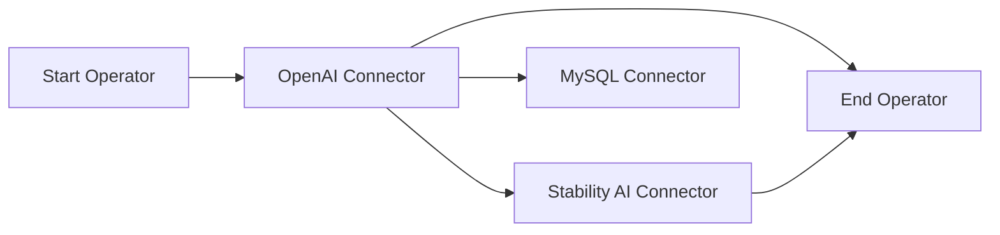
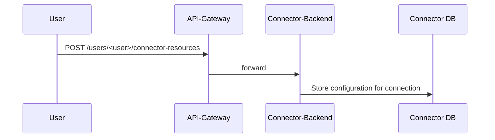
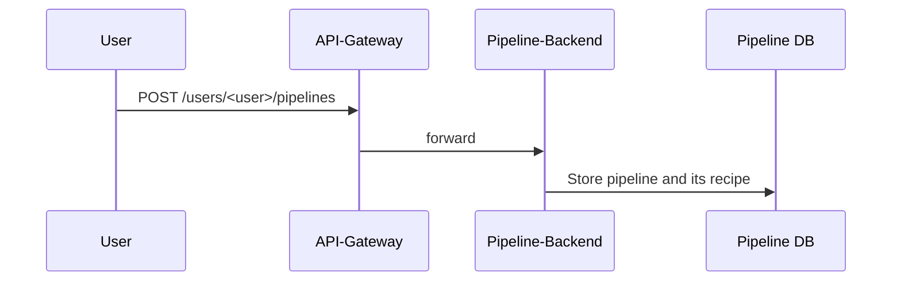
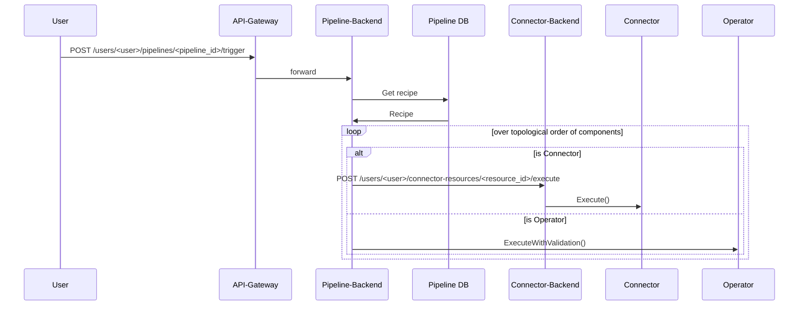

# Contributing Guidelines

We appreciate your contribution to this amazing project! Any form of engagement is welcome, including but not limiting to
- feature request
- documentation wording
- bug report
- roadmap suggestion
- ...and so on!

Please refer to the [community contributing section](https://github.com/instill-ai/community#contributing) for more details.

## Development and codebase contribution

Before delving into the details to come up with your first PR, please familiarise yourself with the project structure of [Instill Core](https://github.com/instill-ai/community#instill-core).

### Concept

In VDP, a pipeline is a DAG (Directed Acyclic Graph) consisting of multiple components.




#### Component
We have two types of components: **connector** and **operator**:


- connector:
  - A connector is used to connect the pipeline to a vendor service.
  - We need to set up a connector resource first to configure the connection.
- operator:
  - An operator is used for data operations inside the pipeline.


**Connector**

- **Connectors** is used for connecting the pipeline to a vendor service, and **connectors** are served by **connector-backend**
- We need to set up a connector **resource** first to configure the connection.
- Setup a Connector Resource



**Operator**
- An operator is used for data operations inside the pipeline.


The key difference between `connector` and `operator` is that `connector` will connect to a vendor. The `connector` only transfer the data, not to process the data. In other hand, The `operator` will process data inside the pipeline.

#### Pipeline

A pipeline is consists of multiple components. We use a pipeline `recipe` to configure the pipeline components.

The `recipe` is in the format
```json
{
    "version": "v1alpha",
    "components": [
        {
            "id": "<component_id>",
            "definition_name": "<definition_name>",
            "resource_name": "<resource_name>",
            "configuration": {
                // component configuration
            }
        }
    ]
}
```
- `id`: the identifier of the component, can not be duplicated inside a pipeline.
- `definition_name`: can be a connector(`connector-definitions/<def_id>`) or operator(`operator-definitions/<def_id>`)
- `resource_name`: we need to create a resource for connector `users/<user>/connector-resources/<resource_id>`, we don't need to setup this for operator.
- `configuration`: component configuration for connector or operator



#### How pipeline triggered

When we trigger a pipeline, the pipeline-backend will calculate the DA and execute the components in topological order.

The workflow is:


### Development

When you want to contribute a new connector or operator, you need to prepare two things:

#### Prepare `config` files

In every connector or operator implementation, we need to use two config files to define the behaviour of the component.

- `definition.json`
    - You can refer to [OpenAI connector](https://github.com/instill-ai/connector-ai/blob/main/pkg/openai/config/definitions.json) as an example.
    - We define the id, uid, vendor info and other metadata in this file.
    - We define the `resource_configuration` in this file, which is used for setting up the connector resource.
- `tasks.json`
    - You can refer to [OpenAI connector](https://github.com/instill-ai/connector-ai/blob/main/pkg/openai/config/tasks.json) as an example.
    - A component can have multiple tasks.
    - We define the input and output schema of each task in this file.
    - The component will auto-generate the `component_specification` and `openapi_specification` based on the input and output schema of the task


| Spec                    | Connector | Operator | Purpose  |
| ----------------------- | --------- | -------- | ------------ |
| resource_specification  | v         |          | setup connection to vendors |
| component_specification | v         | v        | setup the parameters and data flow of this component |
| openapi_specification  | v         | v        | describe the input and output structure of this component |

<!-- TODO:
1. prepare more introduction for how we convert the tasks.json into component_specification and openapi_specification
2. describe more details about the api payload  -->

#### Implement all interfaces defined in this [Component Package](ttps://github.com/instill-ai/component)

In [component.go](https://github.com/instill-ai/component/blob/main/pkg/base/component.go), we define `IComponent` (`IConnector` and `IOperator`) and `IExecution` as base interfaces. All components (including connector and operator) must implement these interfaces.

```go
// All connectors need to implement this interface
type IConnector interface {
    CreateExecution(defUID uuid.UUID, task string, config *structpb.Struct, logger *zap.Logger) (base.IExecution, error)
    Test(defUid uuid.UUID, config *structpb.Struct, logger *zap.Logger) (connectorPB.ConnectorResource_State, error)
}

// All operators need to implement this interface
type IOperator interface {
    CreateExecution(defUID uuid.UUID, task string, config *structpb.Struct, logger *zap.Logger) (base.IExecution, error)
}

// All connectors and operators need to implement this interface
type IExecution interface {
    Execute(inputs []*structpb.Struct) ([]*structpb.Struct, error)
}
```

- `CreateExecution()`:
    - We need to implement this for all components.
    - We can store some additional data in the component struct via this function.
- `Test()`
    - We use this to test the connection between vdp and vendor.
- `Execute()`
    - This is the most important function for the component.
    - All the data manipulation logic will be here.
    - This function will be wrapped by `ExecuteWithValidation()` inside component [here](https://github.com/instill-ai/component/blob/e74bd510319ccf3c1dc2b3a5a97f762a0bce9414/pkg/base/execution.go#L74). `ExecuteWithValidation()` will do schema validation for both the input and output of `Execute()`. The schema is defined by the `openapi_specification` which is generated by `tasks.json`

<!--
TODO:
 1. explain how we import the connectors or operators like [here](https://github.com/instill-ai/connector-ai/blob/main/pkg/main.go)
 2. Add a step by step example to implement a new connector or operator.
-->

#### Repositories

Currently, we maintain four repositories for component implementations
- [Connector AI](https://github.com/instill-ai/connector-ai): collect all connector implementations related to AI Vendors
- [Connector Data](https://github.com/instill-ai/connector-data): collect all connector implementations related to Data Vendors
- [Connector Blockchain](https://github.com/instill-ai/connector-blockchain): collect all connector implementations related to Blockchain Vendors
- [Operator](https://github.com/instill-ai/operator): collect all operator implementations

### Sending PRs

Please take these general guidelines into consideration when you are sending a PR:

1. **Fork the Repository:** Begin by forking the repository to your GitHub account.
2. **Create a New Branch:** Create a new branch to house your work. Use a clear and descriptive name, like `<your-github-username>/<what-your-pr-about>`.
3. **Make and Commit Changes:** Implement your changes and commit them. We encourage you to follow these best practices for commits to ensure an efficient review process:
   - Adhere to the [conventional commits guidelines](https://www.conventionalcommits.org/) for meaningful commit messages.
   - Follow the [7 rules of commit messages](https://chris.beams.io/posts/git-commit/) for well-structured and informative commits.
   - Rearrange commits to squash trivial changes together, if possible. Utilize [git rebase](http://gitready.com/advanced/2009/03/20/reorder-commits-with-rebase.html) for this purpose.
4. **Push to Your Branch:** Push your branch to your GitHub repository: `git push origin feat/<your-feature-name>`.
5. **Open a Pull Request:** Initiate a pull request to our repository. Our team will review your changes and collaborate with you on any necessary refinements.

When you are ready to send a PR, we recommend you to first open a `draft` one. This will trigger a bunch of `tests` [workflows](https://github.com/instill-ai/component/tree/main/.github/workflows) running a thorough test suite on multiple platforms. After the tests are done and passed, you can now mark the PR `open` to notify the codebase owners to review. We appreciate your endeavour to pass the integration test for your PR to make sure the sanity with respect to the entire scope of **Instill Core**.


## Last words

Your contributions make a difference. Let's build something amazing together!
