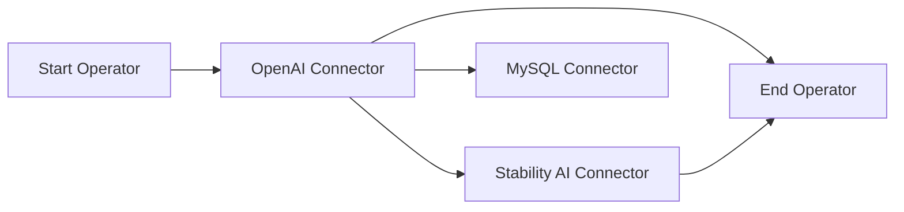

# Contributing Guidelines

We appreciate your contribution to this amazing project! Any form of engagement is welcome, including but not limiting to
- feature request
- documentation wording
- bug report
- roadmap suggestion
- ...and so on!

Please refer to the [community contributing section](https://github.com/instill-ai/community#contributing) for more details.

## Development and codebase contribution

Before delving into the details to come up with your first PR, please familiarise yourself with the project structure of [Instill Core](https://github.com/instill-ai/community#instill-core).

### Concept

In VDP, a pipeline is a DAG (Directed Acyclic Graph) consisting of multiple components.

We have two types of components:

- connector:
  - A connector is used to connect the pipeline to a Vendor service.
  - We need to set up a connector resource first to configure the connection.
- operator:
  - An operator is used for in-pipeline data operations.



The key difference between `connector` and `operator` is that `connector` will connect to a vendor. The `connector` only transfer the data, not to process the data. In other hand, The `operator` will process data inside the pipeline.

### Development

When you want to contribute a new connector or operator, you need to prepare two things:

#### Prepare a `definition.json`
We use a `definition.json` to define all the configuration and input/output format for a component.
Inside the `definition.json`, we have three fields `resource_specification`, `component_specification` and `openapi_specifications`.

| Spec                    | Connector | Operator | Purpose  |
| ----------------------- | --------- | -------- | ------------ |
| resource_specification  | v         |          | setup connection to vendors | 
| component_specification | v         | v        | setup the parameters and data flow of this component | 
| openapi_specifications  | v         | v        | describe the input and output structure of this component | 

 Please refer to [OpenAI definition.json](https://github.com/instill-ai/connector-ai/blob/main/pkg/openai/config/definitions.json) as example.

#### Implement all interfaces defined in this [Component Package](ttps://github.com/instill-ai/component)

In [component.go](https://github.com/instill-ai/component/blob/main/pkg/base/component.go), we define `IComponent` and `IExecution` as base interfaces. All components (including connector and operator) must implement these interface

```go
// All component need to implement this interface
type IComponent interface {

	// Functions that need to be implemented in component implementation
	// Create a execution by definition uid and component configuration
	CreateExecution(defUid uuid.UUID, config *structpb.Struct, logger *zap.Logger) (IExecution, error)
}

type IExecution interface {
	// Functions that shared for all connectors
	// Validate the input and output format
	ValidateInput(data []*structpb.Struct, task string) error
	ValidateOutput(data []*structpb.Struct, task string) error

	// Functions that need to be implemented in connector implementation
	// Execute
	Execute(inputs []*structpb.Struct) ([]*structpb.Struct, error)
}
```

The most important one is `Execute()`, the pipeline DAG will use this function to execute each component.


In [connector.go](https://github.com/instill-ai/component/blob/main/pkg/base/connector.go), we define `IConnector` as base interface. All connectors must implement these interface. We use this interface to construct a connector. In [operator.go](https://github.com/instill-ai/component/blob/main/pkg/base/operator.go), we define `IOperator` as base interface. All connectors must implement these interface. We use this interface to construct a operator.

#### Repositories

Currently, we maintain four repositories for component implementations
- [Connector AI](https://github.com/instill-ai/connector-ai): collect all connector implementations related to AI Vendors
- [Connector Data](https://github.com/instill-ai/connector-data): collect all connector implementations related to Data Vendors
- [Connector Blockchain](https://github.com/instill-ai/connector-blockchain): collect all connector implementations related to Blockchain Vendors
- [Operator](https://github.com/instill-ai/operator): collect all operator implementations

### Sending PRs

Please take these general guidelines into consideration when you are sending a PR:

1. **Fork the Repository:** Begin by forking the repository to your GitHub account.
2. **Create a New Branch:** Create a new branch to house your work. Use a clear and descriptive name, like `<your-github-username>/<what-your-pr-about>`.
3. **Make and Commit Changes:** Implement your changes and commit them. We encourage you to follow these best practices for commits to ensure an efficient review process:
   - Adhere to the [conventional commits guidelines](https://www.conventionalcommits.org/) for meaningful commit messages.
   - Follow the [7 rules of commit messages](https://chris.beams.io/posts/git-commit/) for well-structured and informative commits.
   - Rearrange commits to squash trivial changes together, if possible. Utilize [git rebase](http://gitready.com/advanced/2009/03/20/reorder-commits-with-rebase.html) for this purpose.
4. **Push to Your Branch:** Push your branch to your GitHub repository: `git push origin feat/<your-feature-name>`.
5. **Open a Pull Request:** Initiate a pull request to our repository. Our team will review your changes and collaborate with you on any necessary refinements.

When you are ready to send a PR, we recommend you to first open a `draft` one. This will trigger a bunch of `tests` [workflows](https://github.com/instill-ai/component/tree/main/.github/workflows) running a thorough test suite on multiple platforms. After the tests are done and passed, you can now mark the PR `open` to notify the codebase owners to review. We appreciate your endeavour to pass the integration test for your PR to make sure the sanity with respect to the entire scope of **Instill Core**.

Refer some of these PRs for a quick sample -  
https://github.com/instill-ai/operator/pull/7  
https://github.com/instill-ai/operator/pull/8  
https://github.com/instill-ai/connector-data/pull/12  
https://github.com/instill-ai/connector-ai/pull/22 (this one is a bit old, the interface is changed now)


## Last words

Your contributions make a difference. Let's build something amazing together!
