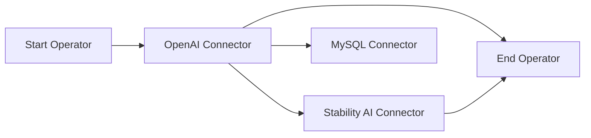
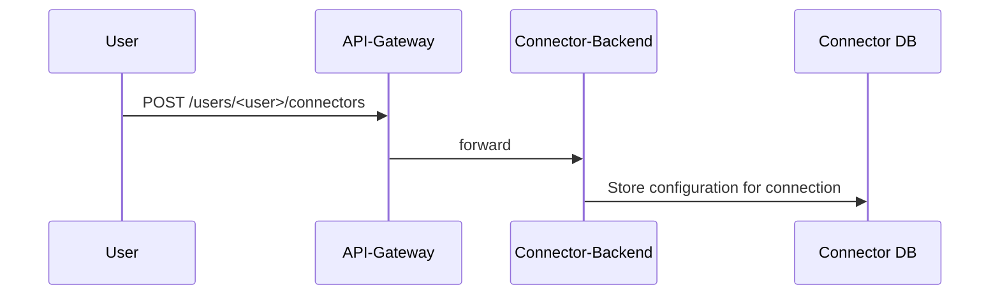
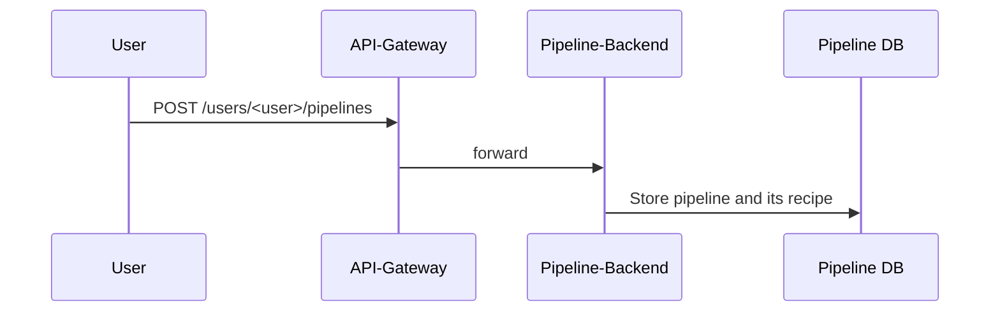

# Contributing Guidelines

We appreciate your contribution to this amazing project! Any form of engagement is welcome, including but not limiting to
- feature request
- documentation wording
- bug report
- roadmap suggestion
- ...and so on!

Please refer to the [community contributing section](https://github.com/instill-ai/community#contributing) for more details.

## Development and codebase contribution

Before delving into the details to come up with your first PR, please familiarise yourself with the project structure of [Instill Core](https://github.com/instill-ai/community#instill-core).

### Concept

In VDP, a pipeline is a DAG (Directed Acyclic Graph) consisting of multiple components.




#### Component

There are different types of component:
- **connector**
  - Queries, processes or transmits the ingested data to a service or app.
  - Users need to configure their connectors (e.g. by providing an API token to a remote service).
- **operator**
  - Performs data injection and manipulation.
- **iterator**
  - Takes an array and executes an operation (defined by a set of nested components) on each of its elements.
- **start** / **end**
  - These special components provide an input / output interface to pipeline triggers.

**Connector**

- **Connectors** are used for connecting the pipeline to a vendor service. They are defined and initialized in the [connector](https://github.com/instill-ai/connector/) repository.
- A connector **resource** needs to be set up first to configure the connection.
- Setup a Connector



**Operator**

- An operator is used for data operations inside the pipeline. They are defined and initialized in the [operator](https://github.com/instill-ai/operator/) repository.

The key difference between `connector` and `operator` is the former will connect to an external service, so it's **I/O bound** while the latter is **CPU bound**. Connectors don't process but transfer data.

#### Pipeline

A pipeline is consists of multiple components. We use a pipeline `recipe` to configure the pipeline components.

The `recipe` is in the format
```json
{
    "version": "v1alpha",
    "components": [
        {
            "id": "<component_id>",
            "definition_name": "<definition_name>",
            "resource_name": "<resource_name>",
            "configuration": {
                // component configuration
            }
        }
    ]
}
```
- `id`: the identifier of the component, can not be duplicated inside a pipeline.
- `definition_name`: can be a connector(`connector-definitions/<def_id>`) or operator(`operator-definitions/<def_id>`)
- `resource_name`: we need to create a resource for connector `users/<user>/connectors/<resource_id>`, we don't need to setup this for operator.
- `configuration`: component configuration for connector or operator



#### How pipelines are triggered

When we trigger a pipeline, the pipeline-backend will calculate the DA and execute the components in topological order.

The workflow is:


### Development

When you want to contribute with a new connector or operator, you need to create the configuration files and implement the `Component` interface.

#### `config` files

2 configuration files define the behaviour of the component:

- `definitions.json`
    - You can refer to [OpenAI connector](https://github.com/instill-ai/connector/blob/main/pkg/openai/v0/config/definitions.json) as an example.
    - We define the id, uid, vendor info and other metadata in this file.
    - We define the `resource_configuration` in this file, which defines the connector resource setup.
- `tasks.json`
    - You can refer to [OpenAI connector](https://github.com/instill-ai/connector/blob/main/pkg/openai/v0/config/tasks.json) as an example.
    - A component can have multiple tasks.
    - The input and output schema of each task is defined in this file.


<!-- TODO:
1. describe more details about the api payload  -->

#### Implement all interfaces defined in this [Component Package](ttps://github.com/instill-ai/component)

In [component.go](https://github.com/instill-ai/component/blob/main/pkg/base/component.go), we define `IComponent` (`IConnector` and `IOperator`) and `IExecution` as base interfaces. All components (including connector and operator) must implement these interfaces.

```go
// All connectors need to implement this interface
type IConnector interface {
    CreateExecution(defUID uuid.UUID, task string, config *structpb.Struct, logger *zap.Logger) (base.IExecution, error)
    Test(defUid uuid.UUID, config *structpb.Struct, logger *zap.Logger) (pipelinePB.Connector_State, error)
}

// All operators need to implement this interface
type IOperator interface {
    CreateExecution(defUID uuid.UUID, task string, config *structpb.Struct, logger *zap.Logger) (base.IExecution, error)
}

// All connectors and operators need to implement this interface
type IExecution interface {
    Execute(inputs []*structpb.Struct) ([]*structpb.Struct, error)
}
```

- `CreateExecution()`:
    - We need to implement this for all components.
    - We can store some additional data in the component struct via this function.
- `Test()`
    - We use this to test the connection between vdp and vendor.
- `Execute()`
    - This is the most important function for the component.
    - All the data manipulation logic will be here.
    - This function will be wrapped by `ExecuteWithValidation()` inside component [here](https://github.com/instill-ai/component/blob/e74bd510319ccf3c1dc2b3a5a97f762a0bce9414/pkg/base/execution.go#L74). `ExecuteWithValidation()` will do schema validation for both the input and output of `Execute()`. The schema is defined by the `openapi_specification` which is generated by `tasks.json`

<!--
TODO:
 1. explain how we import the connectors or operators like [here](https://github.com/instill-ai/connector/blob/main/pkg/main.go)
 2. Add a step by step example to implement a new connector or operator.
-->

#### Repositories

Currently, we maintain four repositories for component implementations
- [Connector](https://github.com/instill-ai/connector): collect all connector implementations
- [Operator](https://github.com/instill-ai/operator): collect all operator implementations

### Sending PRs

Please take these general guidelines into consideration when you are sending a PR:

1. **Fork the Repository:** Begin by forking the repository to your GitHub account.
2. **Create a New Branch:** Create a new branch to house your work. Use a clear and descriptive name, like `<your-github-username>/<what-your-pr-about>`.
3. **Make and Commit Changes:** Implement your changes and commit them. We encourage you to follow these best practices for commits to ensure an efficient review process:
   - Adhere to the [conventional commits guidelines](https://www.conventionalcommits.org/) for meaningful commit messages.
   - Follow the [7 rules of commit messages](https://chris.beams.io/posts/git-commit/) for well-structured and informative commits.
   - Rearrange commits to squash trivial changes together, if possible. Utilize [git rebase](http://gitready.com/advanced/2009/03/20/reorder-commits-with-rebase.html) for this purpose.
4. **Push to Your Branch:** Push your branch to your GitHub repository: `git push origin feat/<your-feature-name>`.
5. **Open a Pull Request:** Initiate a pull request to our repository. Our team will review your changes and collaborate with you on any necessary refinements.

When you are ready to send a PR, we recommend you to first open a `draft` one. This will trigger a bunch of `tests` [workflows](https://github.com/instill-ai/component/tree/main/.github/workflows) running a thorough test suite on multiple platforms. After the tests are done and passed, you can now mark the PR `open` to notify the codebase owners to review. We appreciate your endeavour to pass the integration test for your PR to make sure the sanity with respect to the entire scope of **Instill Core**.


## Last words

Your contributions make a difference. Let's build something amazing together!
